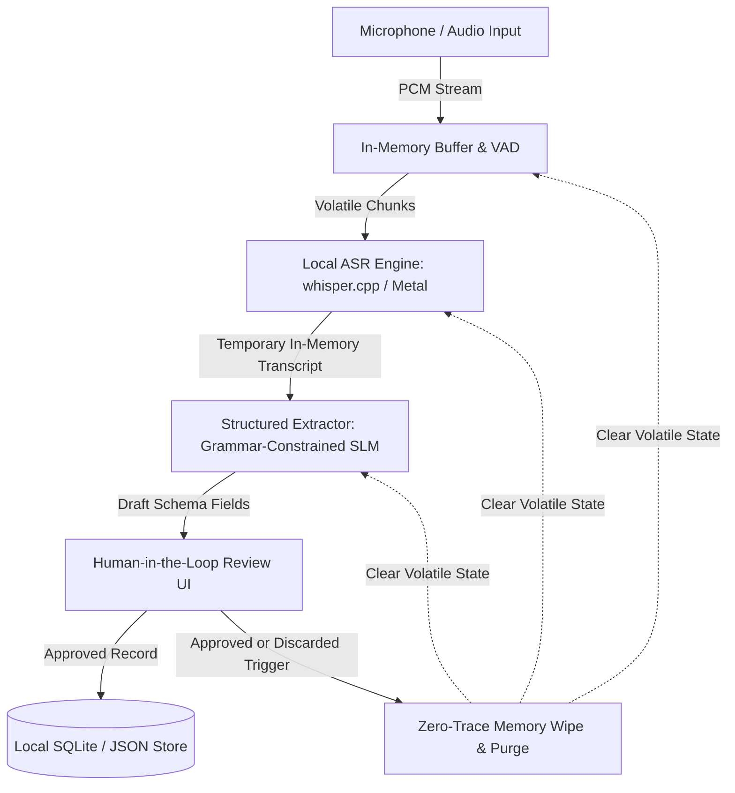

project_outline: "[[00-project/01-project-outline]]"

# Locally Running, Privacy-Oriented Speech Recognition and Structured Logging System

## 1. Actors and permissions

| Role | Needs | Responsibility / access |
| --- | --- | --- |
| Operator / Reviewer | Capture confidential discussions, review extracted structured data, and commit compliant logs | Controls audio capture, edits/approves extracted fields, triggers memory purges, and exports structured records |
| System Auditor / Supervisor | Verify privacy compliance, benchmark records, and data retention policies | Inspects audit trails, reviews benchmarking metrics (WER, latency, RAM), and validates template schemas |

## 2. Use cases / user stories

### Capture conversation and export approved structured log
* **Actor:** Operator / Reviewer
* **Precondition:** Local application is running with an initialized offline ASR engine and structured template loaded.
* **Main flow:**
  1. The actor initiates audio capture (or uploads a local WAV file) for a confidential session.
  2. The system streams audio directly into a volatile memory buffer (RAM) and applies Voice Activity Detection (VAD).
  3. The local ASR engine transcribes speech into a temporary in-memory textual representation.
  4. The extraction module parses the temporary transcript against the active template (extracting timestamp, participants, summary, and action items).
  5. The system presents the populated structured fields to the actor for review.
  6. The actor reviews, corrects any uncertain/missing fields, and confirms final approval.
  7. The system saves the approved structured log to the local SQLite database / JSON store.
  8. The system executes a zero-trace memory purge, zeroing and releasing the raw audio buffer and verbatim transcript from RAM.
* **Alternative / error flows:** If speech clarity is insufficient, the system flags uncertain fields with a warning badge and prompts the actor for manual input. If the actor cancels the session before approval, the system immediately wipes the volatile audio buffer and transcript without persisting any data.
* **Postcondition:** Only the approved structured log is persisted to storage; no audio or raw transcript remains in memory or on disk.

## 3. Functional requirements

| Requirement | Acceptance criteria | Priority |
| --- | --- | --- |
| Local audio ingestion without persistent recording | Given an active session, when audio is captured via microphone or file upload, then data is buffered strictly in volatile memory (RAM) and never written to disk. | Must |
| Offline speech-to-text inference | Given in-memory audio buffers, when transcription is triggered, then local offline models (whisper.cpp / faster-whisper) produce a temporary transcript without network requests. | Must |
| Template-driven structured extraction | Given a temporary transcript, when parsed against a predefined template schema, then structured fields (metadata, entities, action items) are extracted deterministically. | Must |
| Human-in-the-loop review interface | Given an extracted log draft, when displayed to the operator, then all fields can be inspected, manually corrected, approved, or discarded. | Must |
| Enforced zero-trace memory purge | Given user approval or session cancellation, when the session terminates, then raw audio buffers and full verbatim transcripts are cryptographically/securely wiped from volatile memory. | Must |
| Configurable local model selection | Given the evaluation interface, when benchmarking, then the operator can switch between model sizes (tiny, base, small) and quantisation profiles (FP16, Q8, Q5, Q4). | Should |
| Local structured export | Given approved logs, when export is requested, then records are emitted in JSON format or persisted to a local SQLite database. | Must |

*Priority:* **Must** = required for the final product; **Should** = important; **Could** = optional if time permits.

## 4. Business rules and constraints

| Rule or constraint | Rationale |
| --- | --- |
| Zero persistent raw audio or verbatim text | Prevents data exposure and fulfills regulatory privacy standards (e.g., GDPR Article 25 privacy by design). |
| Complete offline isolation | Eliminates external data leak risks by disabling external network communication during audio processing and inference. |
| Mandatory human approval before commit | Ensures structured log integrity and guards against algorithmic hallucinations or misrecognitions. |
| Host resource ceiling adherence | Local inference must operate reliably within standard workstation memory constraints (e.g., Apple Silicon Unified Memory). |

## 5. User interface and workflow

The application interface consists of three primary views:
1. **Live Ingestion View:** Displays audio level indicators, VAD status, active model configuration, and session start/stop controls.
2. **Review & Validation Workspace:** Side-by-side or form-based review area displaying the extracted structured fields (session metadata, identified participants, categorized decisions, action points) with confidence highlights for rapid editing.
3. **Structured Archive & Benchmark Dashboard:** Displays persisted structured logs, JSON export utilities, and offline benchmark telemetry (WER, inference latency, memory peak).

## 6. Non-functional requirements

| Requirement | How it will be verified |
| --- | --- |
| Zero disk residue for raw audio/transcripts | File system monitoring (fsevents/lsof) verifying no temporary audio or raw transcript files exist on disk before, during, or after execution. |
| Low inference latency | Real-Time Factor (RTF) measurement across evaluated models, targeting RTF < 1.0 on local hardware. |
| Constrained memory footprint | Continuous resident memory (RSS) profiling ensuring baseline operations do not exceed memory thresholds during inference. |
| Usability in review turnaround | Timed usability evaluation measuring the duration required for an operator to review and approve a 2-minute dialogue log. |

## 7. Open questions and risks

| Question / risk | Impact | Owner | Resolution / decision |
| --- | --- | --- | --- |
| Trade-off between tiny vs. small model accuracy on technical jargon | High WER on specialised terms | Student | Evaluate quantised small models and domain-specific prompting/lexicon injection. |
| In-memory security on managed runtimes (Python garbage collection) | Residual string artifacts in memory | Student | Implement explicit buffer zeroing using memoryview/ctypes before deallocation. |
| Structured parsing reliability with lightweight local LLMs | Malformed JSON output | Student | Use constrained decoding / JSON schema enforcement (e.g., instructor / guidance frameworks). |

## 8. Initial technical specification proposal

### Proposed solution
The system is constructed as a modular local architecture running on macOS (Apple Silicon). A lightweight audio capture layer buffers sound in volatile memory using PyAudio/SoundDevice and WebRTC VAD. Local ASR inference is driven by whisper.cpp (leveraging Metal acceleration) or faster-whisper. Structured extraction applies schema-constrained local Small Language Models (e.g., Qwen2.5 / Llama-3.2 via llama.cpp) or deterministic parsers. A local web-based review interface (FastAPI backend + minimalist frontend) coordinates human validation and issues enforced memory deallocation upon log commit to SQLite.

### Technology direction

| Area | Candidate technology / approach | Reason for consideration | Open question / risk |
| --- | --- | --- | --- |
| Local ASR Engine | whisper.cpp / faster-whisper | Native C/C++ execution, Metal acceleration, diverse quantisation formats | Integration wrapper latency with Python runtime. |
| Structured Extraction | llama.cpp / local SLM with grammar constraints | Guarantees valid JSON schema output without cloud dependencies | Token generation speed on low-parameter models. |
| Backend & API | FastAPI (Python) | High-performance asynchronous API, clean integration with ML bindings | Careful memory management required for large byte buffers. |
| Review UI | Vite / React or lightweight vanilla web UI | Responsive form validation and ergonomic keyboard shortcuts | Designing high-speed keyboard approval workflows. |
| Local Storage | SQLite / JSON Files | Serverless, zero-configuration local structured database | Concurrency handling during continuous log writes. |

### Initial architecture sketch

### Feasibility and technical risks

| Risk / assumption | Validation planned for semester 2 | Fallback approach |
| --- | --- | --- |
| whisper.cpp provides real-time transcription with Metal on Apple Silicon. | Benchmark tiny, base, and small models across quantisation levels (Q4_0, Q8_0, FP16). | Use faster-whisper (CTranslate2) if C++ wrapper overhead is excessive. |
| Memory purge completely clears speech data without OS swapping leaks. | Memory dump analysis and swap disablement validation during test runs. | Force OS virtual memory locking (`mlock`) for sensitive memory segments. |
| Grammar-constrained SLM produces reliable structured fields on 3B models. | Evaluate extraction accuracy across 50 synthetic test conversations. | Fall back to hybrid regex/entity-matching pipeline for strict template fields. |
