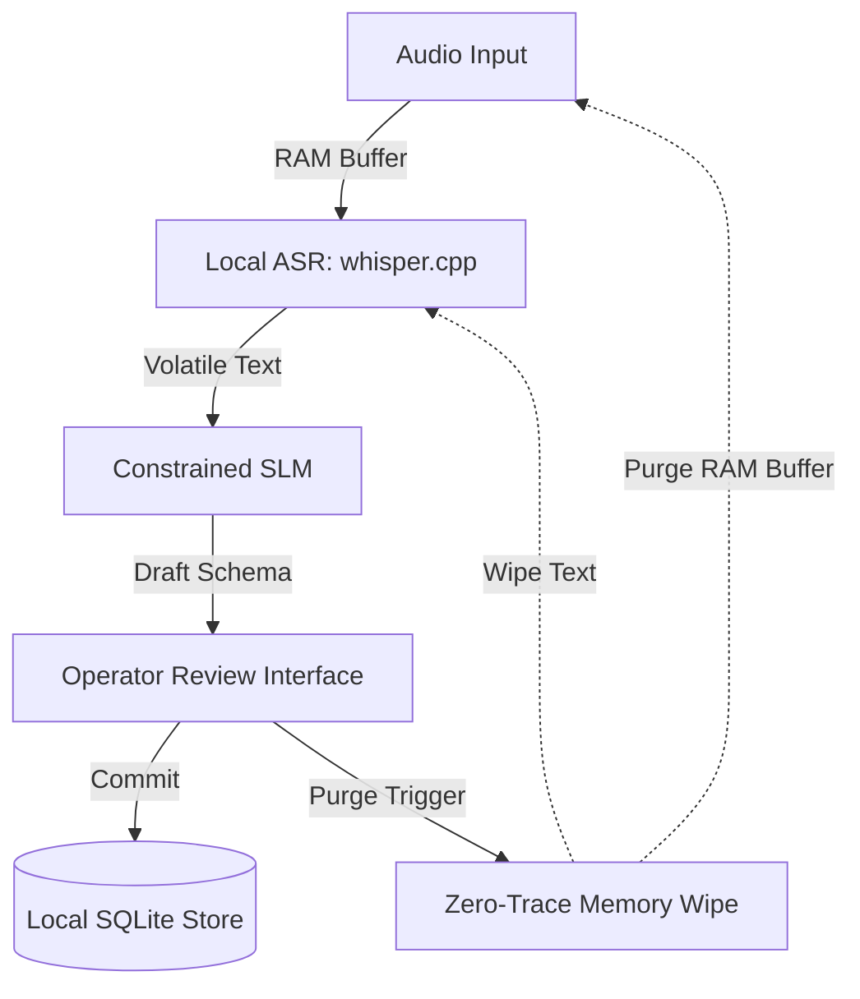

project_outline: "[[00-project/01-project-outline]]"

# PROJECT TITLE
Locally Running, Privacy-Oriented Speech Recognition and Structured Logging System

Author: Huseyin Samet Alakus  
Neptun: XQVC11  
Supervisor: Tamás STORCZ  
Project ID: 2026-ST-05

# Specification summary

* **Core Objective:** Design and validate an offline speech-to-structured-log pipeline enforcing strict data privacy.
* **Architectural Principle:** Privacy-by-design with zero persistent retention of intermediate audio or verbatim speech transcripts.
* **Key Deliverable:** Comprehensive technical specification (`02-specification.md`) detailing functional requirements, hardware limits, and evaluation methodologies.

# Main user journeys and requirements

* **Operator Review Journey:** Ingest audio to RAM, inspect extracted structured fields, manually correct uncertainties, and approve final log.
* **Core Requirements:**
  * **Must:** 100% offline inference, volatile-only audio ingestion, and enforced memory purge upon session termination.
  * **Must:** Predefined schema extraction (JSON/SQLite) and interactive human-in-the-loop review interface.

# Initial technical proposal
* **Local Speech Recognition:** `whisper.cpp` (Metal-accelerated on Apple Silicon) / `faster-whisper` for low-latency offline transcription.
* **Structured Extraction:** Local Small Language Models (e.g., Qwen2.5 / Llama-3.2 via `llama.cpp`) constrained by grammar/JSON schema.
* **Application Stack:** Python runtime with FastAPI backend for memory coordination and a lightweight local review web interface.
* **Storage & Privacy:** Persistent storage restricted strictly to approved SQLite/JSON records; memory zeroing applied to audio buffers.

# Semester-2 implementation plan

| Timeline | Phase Focus | Key Deliverables |
| --- | --- | --- |
| **Weeks 1–4** | Audio Pipeline & Local ASR | Volatile buffer with WebRTC VAD, Metal-accelerated `whisper.cpp` |
| **Weeks 5–8** | Structured Extraction & Review UI | Grammar-constrained SLM integration, human-in-the-loop review workspace |
| **Weeks 9–11** | Benchmarking & Verification | WER, RTF, RSS profiling across model sizes; zero-residue disk validation |
| **Weeks 12–14** | Thesis & Project Defense | Final documentation, benchmark telemetry analysis, final defense |

# Open risks and next steps
* **Open Risks:**
  * **Accuracy vs. Latency:** Trade-off between tiny and small quantized models on technical vocabulary.
  * **Memory Sanitization:** Ensuring complete memory sanitization across managed language runtimes (Python GC vs. OS swap).
* **Next Steps:**
  * Begin repository code scaffolding for the volatile audio ingestion buffer.
  * Set up local synthetic conversation test suites for offline validation.
